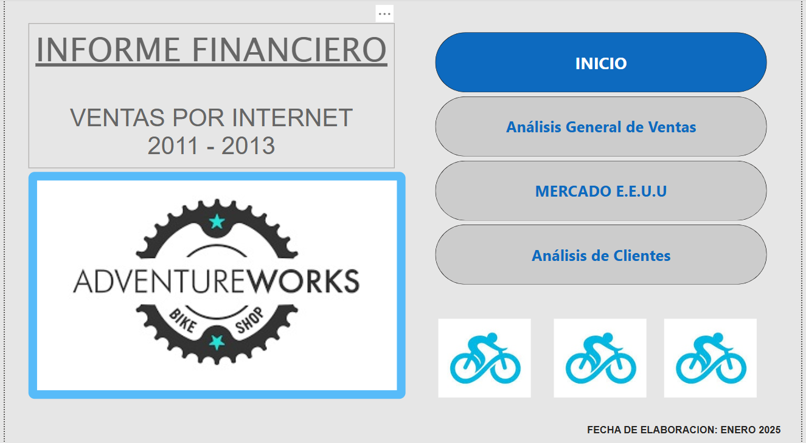
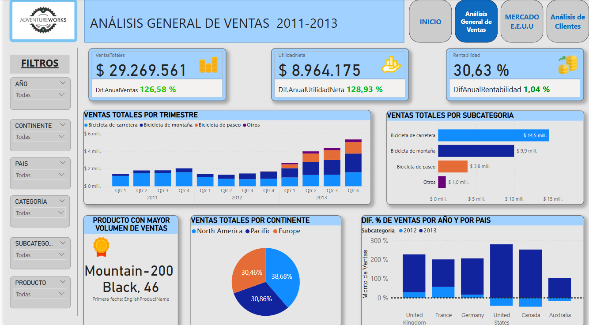
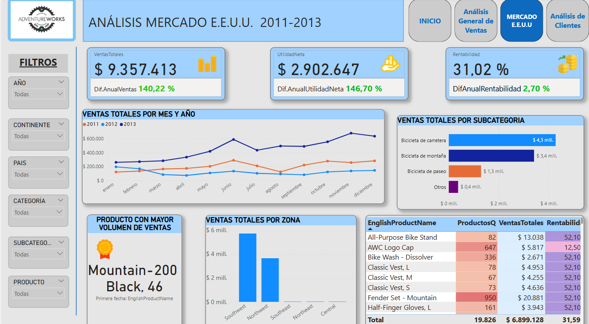
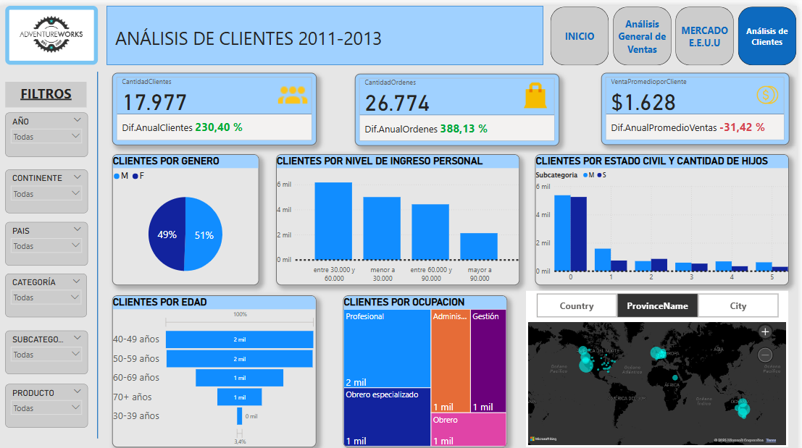

# 🧠 Análisis de Ventas, Costos y Utilidades para la Empresa Adventures Works en Power BI

Este proyecto corresponde al Módulo 3 del bootcamp de **Data Analytics de Soy Henry**.

---

🔍 **Objetivo del proyecto**

Brindar información clave sobre **ventas, utilidades y rentabilidad** de la empresa **Adventures Works** para facilitar la toma de decisiones estratégicas en las áreas de compras, producción y comercialización.

El análisis pone foco en el tipo de productos vendidos y en la **segmentación de clientes**, permitiendo a los equipos de ventas, compras y producción:

- Detectar productos con tendencia de demanda creciente y aquellos con menor desempeño.
- Optimizar recursos en regiones o segmentos específicos.
- Identificar perfiles de clientes para definir estrategias de comunicación y marketing más efectivas.

---

## ✅ Etapas del proyecto

1. **Análisis Exploratorio Inicial (EDA)**  
   - Estructura y tamaño de la base de datos  
   - Tipos de datos  
   - Estadísticas descriptivas (máximo, mínimo, media, moda)  
   - Distribución de variables  
   *(realizado con SQL)*

2. **Procesamiento de datos (ETL)**  
   - Filtrado de columnas y registros  
   - Ajustes de tipos de datos y creación de medidas  
   *(realizado en Power BI)*

3. **Análisis Exploratorio Final (EDA 2)**  
   - Visualización de variables clave mediante gráficos  
   - Identificación de tendencias y patrones  
   *(realizado con Power BI)*

4. **Visualización y presentación de resultados**  
   - Dashboard final en Power BI con KPIs clave  
   - Conclusiones y recomendaciones para la toma de decisiones estratégicas

---

## 📁 Archivos del repositorio

- `📄 Costumer_dim.xlsx`: Contiene la base de datos utilizada para el análisis.  
- `📊 Power_bi_Adventures_Works.pbix`: Archivo de Power BI con el dashboard final.  
- `📘 README.md`: Este archivo.

---

## 🧪 Tecnologías utilizadas

- **Base de datos:** Microsoft SQL Server  
- **Visualización de datos:** Power BI

---

## ✨ Vista previa del dashboard

A continuación, se presenta una vista del tablero desarrollado:

